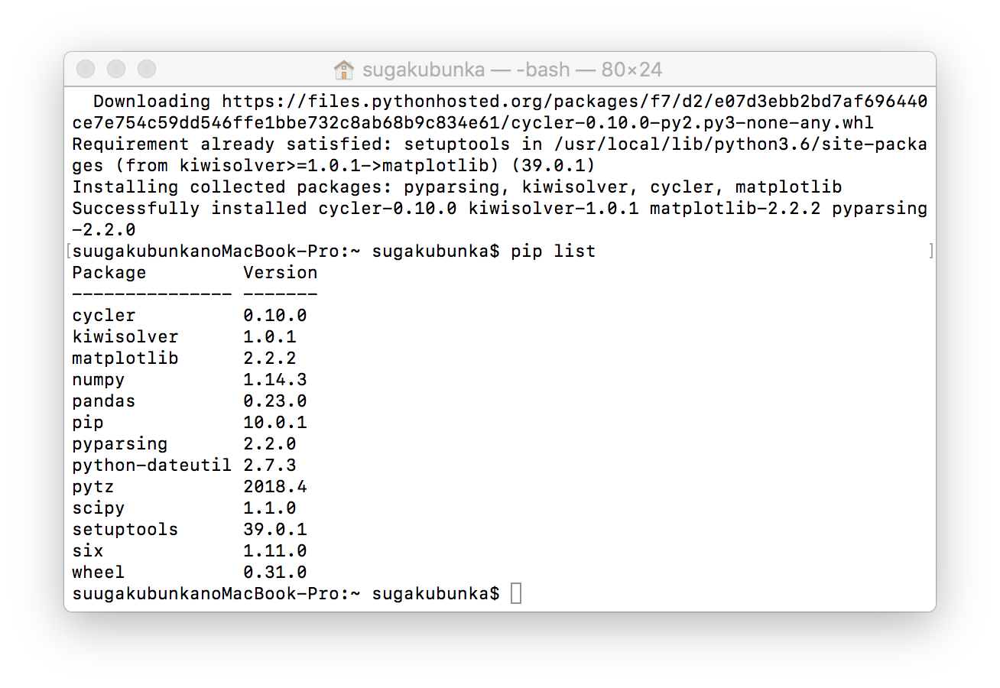

- pythonがインストールされているか確認
- pycharmからライブラリが使えるか確認

# Homebrewのインストール
まずすでにHomebrewが入っているかどうか確かめます。
```brew
which brew
```
を実行して何も出なければインストールされていません。


インストールされていれば以下のように表示されます。


インストールの手順
以下のwebpageにあるように、
```bash
/usr/bin/ruby -e "$(curl -fsSL https://raw.githubusercontent.com/Homebrew/install/master/install)"
```
を実行します。


ここではmac起動時に入力するパスワードを入力します。

すでにインストールされている場合
```bash
brew update
```
しておきます。


# pythonのインストール
次にHomebrewを使ってpython3をインストールします。
```bash
brew install python
```


終了後`brew list`として`python`と表示されればokです。


ターミナルから`python`で起動できるか確かめます。

このままだとPython 2.7.10となっていてpython3が起動できていません。
そのためにPATHを通します。

まず`vi .bash/profile`と入力します。
次にキーボードの`i`を入力し
`export PATH="/usr/local/opt/python/libexec/bin:$PATH"`
と入力します。
その後`esc`キーをおし、`:wq`と入力し`Enter`キーをおします。


その後
```bash
source .bash_profile
```
を実行したのち、改めて
```bash
python
```
と実行すると以下のようにPython 3.6.5が起動されます。


# パッケージのインストール
次に必要なパッケージのインストールを行います。
```bash
pip install scipy
```
と入力し、実行します。


同様にして
```bash
pip install pandas
pip install matplotlib
pip install scikit-learn
```
を実行します。


その後`pip list`を実行して、以下のように必要なパッケージが表示されればokです。


# PyCharmのインストール
まずbrew caskをインストールするため
```bash
brew tap caskroom/cask
brew install caskroom/cask
```
を実行します。

次にpycharmをインストールするため
```bash
brew cask install pycharm-ce
```
を実行します。


# PyCharmの実行
アプリケーションからPyCharmを選んで起動すると、下のような画面が出てきます。

Create New Projectを選びます。

Project InterpreterからExisting interpreterを選び、先ほどインストールしてpython 3.6を選びます。


File -> New -> Python fileを選びます。


下の画面と同じコードを書き、Runから実行します。


次のような画面が出力されれば成功です。


