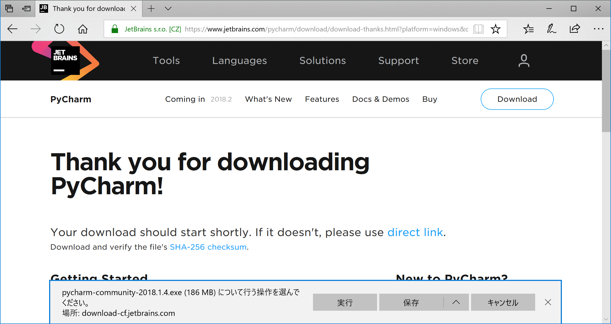
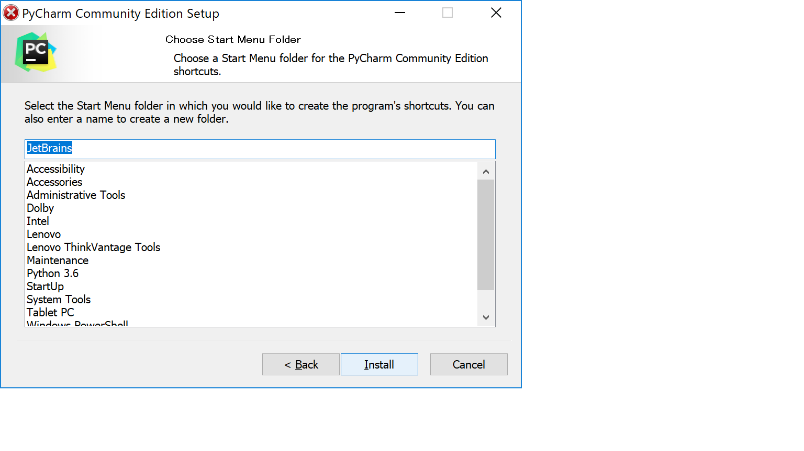
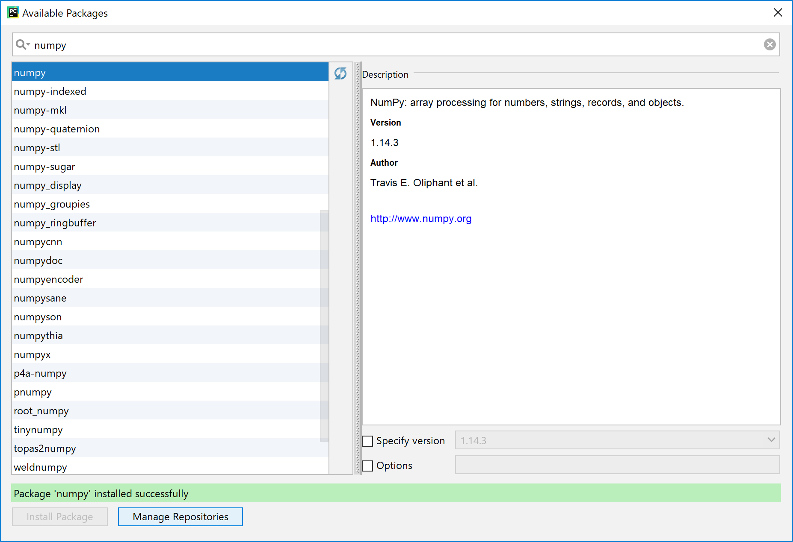

# Python3とPyCharmのインストール方法
すうがくぶんか「基礎から学ぶPython講座」受講生向けの
python3及びPyCharmインストール手順です。
python3のインストール方法はいくつかありますが、
ここでは準備が少ない方法を紹介します。

こちらはwindowsユーザー向けです。

# Python3のインストール

まずはPython3をインストールします。
すでにインストールされている場合は、こちらは飛ばしても大丈夫です。

まず、以下のページを開きます。
https://www.python.org/downloads/

Download Python 3.6.5をクリックし、実行を選択します。


しばらくしてダウンロードが終わると、以下のようにインストーラが起動するので、
install Nowを選びます。


しばらくするとインストールが終了するのでcloseを選びます。


以上でPython3のインストールが終了です。

# PyCharmのインストール
次にPyCharmをインストールします。
すでにPyCharmをインストールしている場合、こちらは飛ばしても大丈夫です。

以下のページを開きます。

https://www.jetbrains.com/pycharm

DOWNLODA NOWを選択します。


今回は無料のcommunity版を使いますので、そちらをDOWNLOADします。


実行するとインストーラのダウンロードが始まります。



インストーラのダウンロードが終わると、インストーラが起動し次のような画面が開くので、Nextを実行します。


次の画面もそのままNextを実行します。


何もチェックせずNextを実行します。


そのままInstallを実行します。



しばらくするとインストールが終わるので、Finishを実行して終了です。


# 必要なパッケージのインストール

最後にPyCharmを起動し、必要なパッケージをインストールします。
左下のメニューから、JetBrains -> JetBrains PyCharm Community Editionと進んでPyCharmを起動します。


初回起動時のみ設定が必要ですが、そのままOKを実行します。


画面の配色をお好みで選んでください。


ここは後からでも必要に応じてインストールできるので、ひとまずは何もインストールせずStart using PyCharmを実行します。


次回起動時からは、この画面が開くはずです。
Create New Projectを選びます。


Projectの名前をつけます。今回はtestとします。


しばらくすると、次のような画面になります。
Closeを実行します。


File -> Default Settings -> Project Interpreter -> Show Allと進みます。


右上の+マークを選び、以下の画面が出たらOKを選びます。


次の画面でもOKを選びます。


先ほどのDefault Settingsの画面で、今準備したPython 3.6 (venv)というものを選択できるので、
それを選択したのち、右の+マークを選びます。
これを選ぶことで、新しいパッケージをインストールすることができます。


以下では今回必要なパッケージである

- numpy
- pandas
- scipy
- matplotlib
- scikit-learn

をインストールします。

手順は全て同様で、一番上の検索欄にパッケージ名を入れると左に出てくるので、
それを選択し左下のInstall Packageを実行すればインストールできます。





全てのパッケージがインストールできると、Degault Settingsの画面が次のようになります。
今インストールしたパッケージの名前があることを確認してください。


セッティングがうまくいっているか確認します。
File -> Settings -> Project:test -> Project Interpreterと進んで、
今準備したPython 3.6 (venv)を選択し、インストールしたライブラリがちゃんと揃っているか確認してください。


# コードの実行確認
最後にpythonのコードがきちんと実行されるか確認します。

File -> New -> Python Fileと進むと名前の入力を求められるので、testとしておきます。


ソースコードエディタが起動するので、こちらにコードを書いていきます。
今回はインストールされたパッケージがきちんと起動するか確認するため、
```python
import numpy as np
import pandas as pd
import matplotlib.pyplot as plt

print("packages are installed")
```
と入力します。


ソースコードの実行は、Run -> Run testと進んで選択します。


画面の下側に、以下のように表示されれば成功です。


